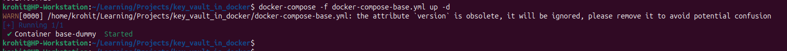
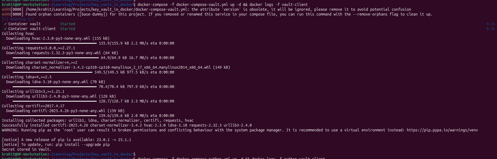
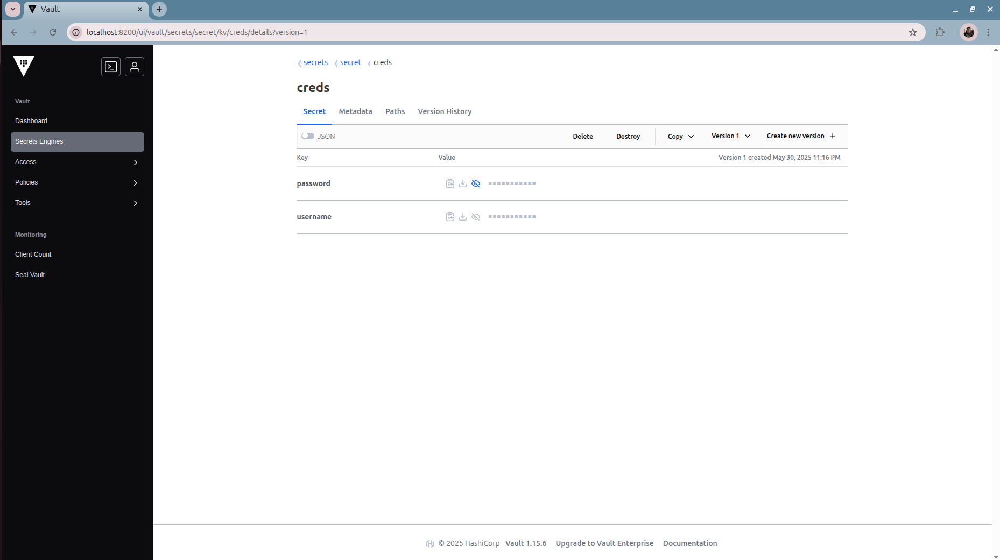
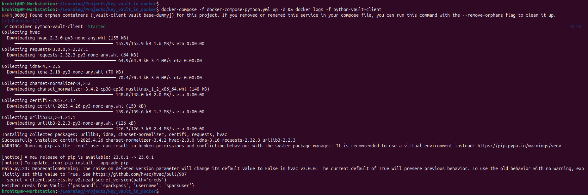
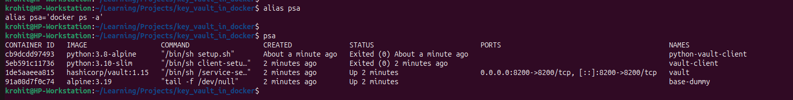

# hello-vault
[HashiCorp Vault](https://www.vaultproject.io/) with Python

# Key Vault in Docker - Demo Project ⚙️

This project demonstrates running HashiCorp Vault in Docker, saving secrets using a Python client, and accessing those secrets from another Python or PySpark service.  
The setup uses Docker Compose with a shared network for seamless service communication.

---

## Quick Start

### 1. Start the Base Service (Creates the Shared Network)

This launches a dummy service to ensure the `vault-poc` network exists and stays alive.

```sh
docker-compose -f docker-compose-base.yml up -d
```
  
**Screenshot**  


---

### 2. Start HashiCorp Vault and the Client (Save Dummy Keys)

This brings up Vault and a Python client that stores a sample secret in Vault.

```sh
docker-compose -f docker-compose-vault.yml up -d
docker logs -f vault-client
```
**Screenshots**  
Console logs:


Web UI:



---

### 3. Start the Python Client to Fetch Secrets from Vault

This service demonstrates fetching secrets from Vault (can be a simple Python or PySpark app).

```sh
docker-compose -f docker-compose-python.yml up -d
docker logs -f python-vault-client
```

**Screenshot**  


---

### All services in docker
**Screenshot**  


## Useful Aliases

Add these to your shell for convenience:

```sh
alias psa='docker ps -a'
alias rma='docker rm -f $(docker ps -aq)'
```

---

## Notes

- All services communicate over the `vault-poc` Docker network.
- The Vault UI is available at [http://localhost:8200/ui](http://localhost:8200/ui) (login with token: `root`).
- Refer to the screenshots for a step-by-step visual guide.

---

## Cleanup

To stop and remove all containers:

```sh
docker-compose -f docker-compose-base.yml down
docker-compose -f docker-compose-vault.yml down
docker-compose -f docker-compose-python.yml down
```

Or remove all containers forcefully:

```sh
rma
```

---

### Happy experimenting! 🎉 